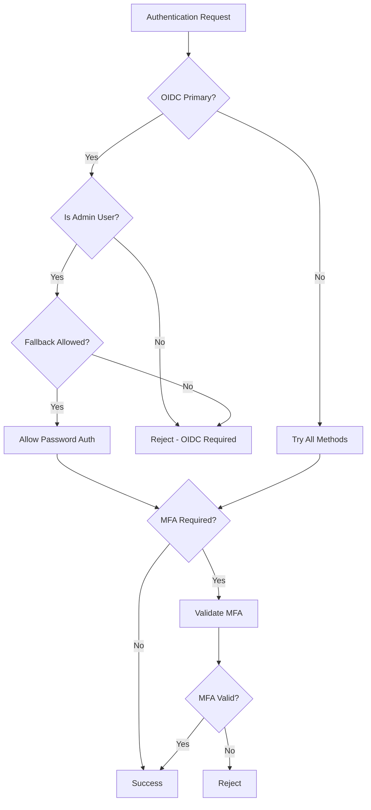

# Authentication System Improvements

## Overview

This document describes the comprehensive improvements made to the GoVPN authentication system, including OIDC fallback logic, admin user management, and enhanced testing.

## Key Features

### 1. OIDC Fallback Logic

The authentication system now supports sophisticated OIDC fallback scenarios:

#### Primary OIDC Mode
When `OIDCPrimary` is enabled:
- Regular users **cannot** authenticate using username/password
- Only OIDC authentication is allowed for non-admin users
- Admin users can optionally use password fallback (if enabled)

#### Configuration Options
```json
{
  "oidc_primary": true,
  "allow_password_fallback": true,
  "admin_usernames": ["admin", "emergency-admin"],
  "require_admin_mfa": true
}
```

### 2. Admin User Management

#### Admin User Detection
The system identifies admin users through:
1. **Configuration-based**: Users listed in `admin_usernames` array
2. **Role-based**: Users with "admin" role in their roles array
3. **OIDC-based**: Users with "admin" role from OIDC claims

#### Admin Privileges
- Password fallback access when OIDC is primary
- Optional MFA enforcement (`require_admin_mfa`)
- Enhanced logging and monitoring

### 3. Enhanced Authentication Flow



## API Endpoints

### Authentication Endpoints

#### POST /api/v1/auth/login
Login with username/password (respects OIDC fallback rules)

**Request:**
```json
{
  "username": "admin",
  "password": "password123",
  "mfa_code": "123456"
}
```

**Response:**
```json
{
  "success": true,
  "data": {
    "token": "jwt-token-here",
    "user": {
      "id": "user-id",
      "username": "admin",
      "roles": ["admin", "user"],
      "source": "local"
    },
    "requires_mfa": false,
    "metadata": {}
  }
}
```

#### GET /api/v1/auth/oidc
Initiate OIDC authentication

**Response:**
```json
{
  "success": true,
  "data": {
    "auth_url": "https://provider.com/auth?...",
    "user_id": "web-user-123"
  }
}
```

#### POST /api/v1/auth/oidc/callback
Handle OIDC callback

**Request:**
```json
{
  "code": "authorization-code",
  "state": "state-parameter"
}
```

#### GET /api/v1/auth/status
Check authentication status

**Headers:**
```
Authorization: Bearer jwt-token
```

**Response:**
```json
{
  "success": true,
  "data": {
    "authenticated": true,
    "user_id": "user-id",
    "username": "admin",
    "roles": ["admin"],
    "source": "local"
  }
}
```

## Configuration Examples

### OIDC Primary with Admin Fallback
```json
{
  "enable_oidc": true,
  "oidc_primary": true,
  "allow_password_fallback": true,
  "admin_usernames": ["emergency-admin"],
  "require_admin_mfa": true,
  "oidc": {
    "enabled": true,
    "provider_url": "https://auth.company.com",
    "client_id": "govpn-client",
    "client_secret": "secret"
  }
}
```

### Mixed Authentication
```json
{
  "enable_oidc": true,
  "enable_ldap": true,
  "oidc_primary": false,
  "allow_password_fallback": true,
  "require_admin_mfa": false
}
```

### OIDC Only (No Fallback)
```json
{
  "enable_oidc": true,
  "oidc_primary": true,
  "allow_password_fallback": false
}
```

## Testing

### Unit Tests
- `TestOIDCFallbackLogic`: Tests OIDC fallback scenarios
- `TestOIDCUserCreation`: Tests OIDC user creation and updates
- `TestAdminUserDetection`: Tests admin user identification
- `TestMFARequirementForAdmins`: Tests MFA enforcement for admins

### Integration Tests
- `TestComplexAuthenticationScenarios`: Complex multi-provider scenarios
- `TestAuthenticationPerformance`: Performance benchmarks
- `TestConcurrentAuthentication`: Concurrent access testing
- `TestSessionLifecycle`: Session management testing

### API Tests
- `TestLoginAPI`: API login endpoint testing
- `TestOIDCFallbackAPI`: API OIDC fallback testing
- `TestAuthStatusAPI`: Authentication status testing

## Security Considerations

### OIDC Primary Mode
- Reduces attack surface by disabling password authentication for regular users
- Centralizes authentication through trusted OIDC provider
- Maintains emergency access for administrators

### MFA Enforcement
- Optional MFA requirement for admin users
- Supports TOTP-based MFA
- Backup codes for recovery

### Token Security
- JWT tokens with configurable expiration
- HMAC-SHA256 signing
- Role-based access control

## Migration Guide

### From Basic Auth to OIDC Primary

1. **Configure OIDC Provider**
   ```json
   {
     "enable_oidc": true,
     "oidc": {
       "provider_url": "https://your-provider.com",
       "client_id": "your-client-id",
       "client_secret": "your-secret"
     }
   }
   ```

2. **Test OIDC Authentication**
   - Verify OIDC login works
   - Test user creation and role mapping

3. **Enable Primary Mode**
   ```json
   {
     "oidc_primary": true,
     "allow_password_fallback": true,
     "admin_usernames": ["your-admin-user"]
   }
   ```

4. **Disable Fallback (Optional)**
   ```json
   {
     "allow_password_fallback": false
   }
   ```

## Troubleshooting

### Common Issues

#### Regular Users Cannot Login
- Check if `oidc_primary` is enabled
- Verify OIDC configuration
- Ensure user is not in `admin_usernames` list

#### Admin Cannot Use Password
- Check `allow_password_fallback` setting
- Verify user is in `admin_usernames` or has "admin" role
- Check OIDC primary mode setting

#### MFA Not Required for Admin
- Verify `require_admin_mfa` is enabled
- Check admin user detection logic
- Ensure MFA provider is configured

### Logging
Authentication events are logged with appropriate levels:
- INFO: Successful authentications, user creation/updates
- ERROR: Authentication failures, configuration errors
- DEBUG: Detailed authentication flow information

## Performance

### Benchmarks
- Authentication: ~650μs per operation (with optimized Argon2)
- Concurrent users: Supports 10+ concurrent authentications
- Memory usage: Minimal overhead for session management

### Optimization Tips
- Use appropriate Argon2 parameters for your environment
- Enable caching for LDAP/OIDC providers
- Configure reasonable session timeouts
- Monitor authentication performance metrics 